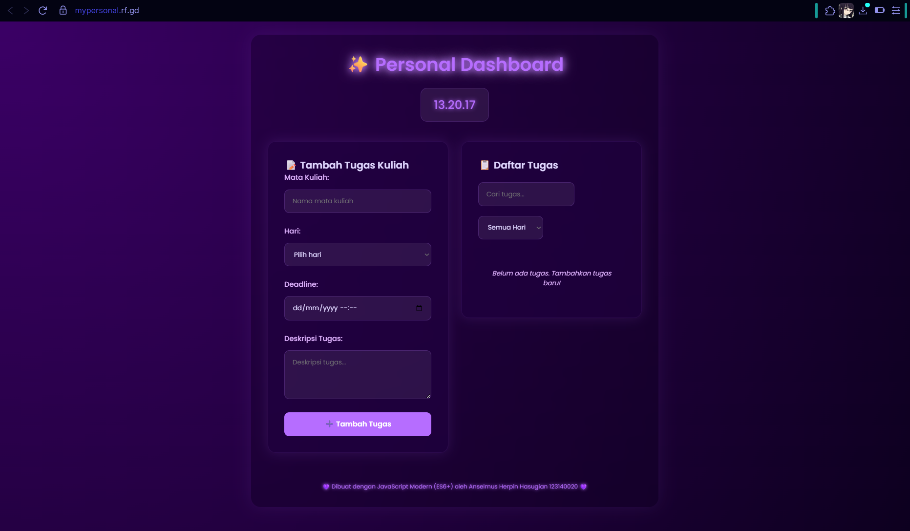
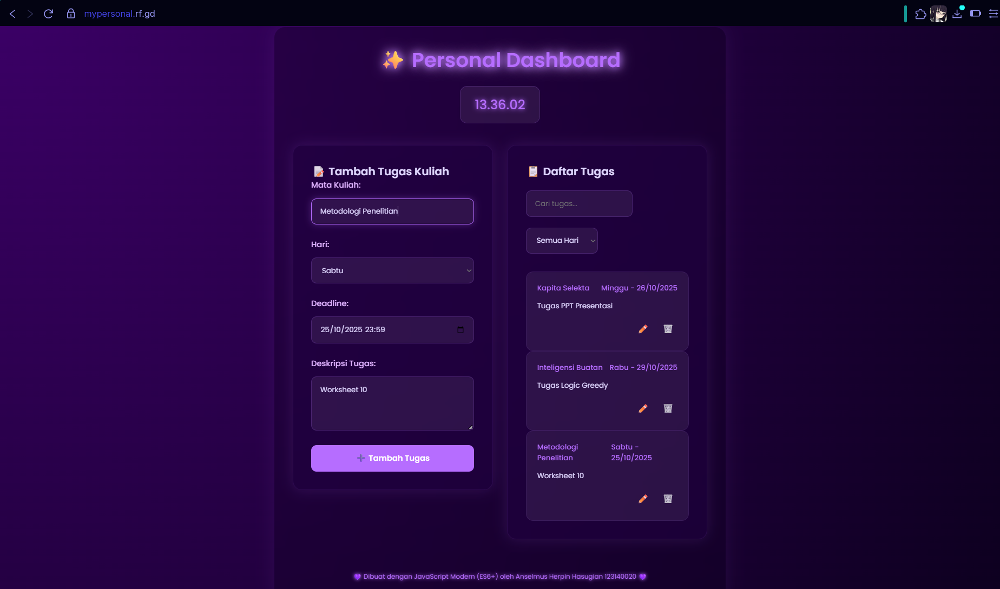
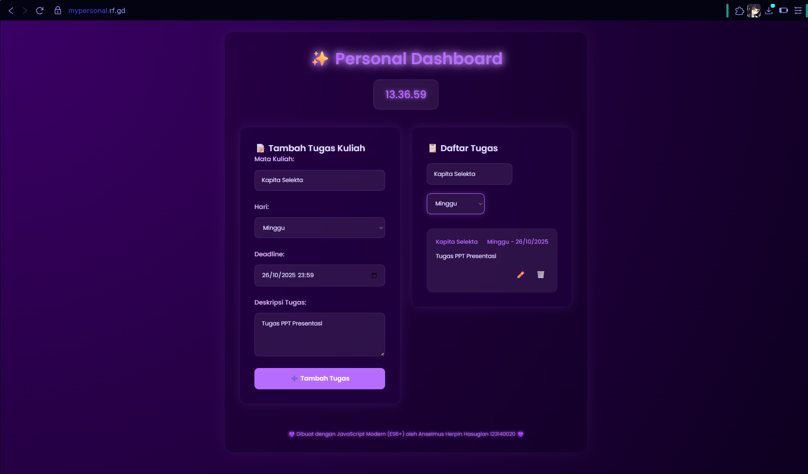

# Tugas Praktikum: Aplikasi Personal Dashboard

## Deskripsi Singkat
Aplikasi Personal Dashboard ini adalah aplikasi web sederhana untuk membantu mahasiswa mengelola daftar tugas kuliah secara interaktif. Pengguna dapat menambah, mengedit, menghapus, dan mencari tugas. Semua data tersimpan secara lokal di browser (localStorage) sehingga tetap aman meski halaman di-refresh.

## Fitur Utama
- Menambah tugas kuliah (mata kuliah, hari, deadline, deskripsi)
- Mengedit tugas yang sudah ada
- Menghapus tugas
- Mencari dan memfilter tugas berdasarkan hari atau kata kunci
- Data tersimpan otomatis di localStorage
- Tampilan modern, responsif, dan mudah digunakan
- Menampilkan jam digital real-time

## Persyaratan & Kriteria Penilaian
- **Interaktif:** Pengguna dapat menambah, mengedit, menghapus informasi
- **Penyimpanan Lokal:** Data menggunakan localStorage
- **Fitur ES6+ Wajib:**
  - let dan const untuk deklarasi variabel
  - Minimal 3 arrow function
  - Template literals untuk rendering dinamis
  - Fungsi asinkron (async/await pada proses tambah tugas)
  - Implementasi Classes (class Dashboard)
- **Desain UI/UX:** Modern, responsif, dan mudah digunakan
- **Dokumentasi & Kerapian Kode:** Kode rapi, terstruktur, dan terdokumentasi

### Kriteria Penilaian
| Aspek                                         | Bobot |
|-----------------------------------------------|-------|
| Fungsionalitas & Interaktivitas aplikasi      | 30%   |
| Implementasi fitur ES6+                       | 25%   |
| Penggunaan localStorage & pengelolaan data    | 20%   |
| Desain UI & UX                               | 15%   |
| Dokumentasi & kerapian kode                   | 10%   |

## Fitur ES6+ yang Diimplementasikan
- Penggunaan `let` dan `const` untuk semua variabel
- Minimal 3 arrow function:
  - `bindSearchAndFilter`
  - `save`
  - `add` (async/await)
  - `handleListClick` (event delegation)
- Template literals untuk rendering dinamis daftar tugas
- Fungsi asinkron (async/await) pada proses tambah tugas
- Implementasi class (`class Dashboard`)

## Screenshot Aplikasi

### Tampilan Awal (Kosong)

### Menambah & Menampilkan Tugas

### Fitur Filter & Edit Tugas

---

> Dibuat oleh Anselmus Herpin Hasugian (123140020) — Praktikum Pemrograman Web
