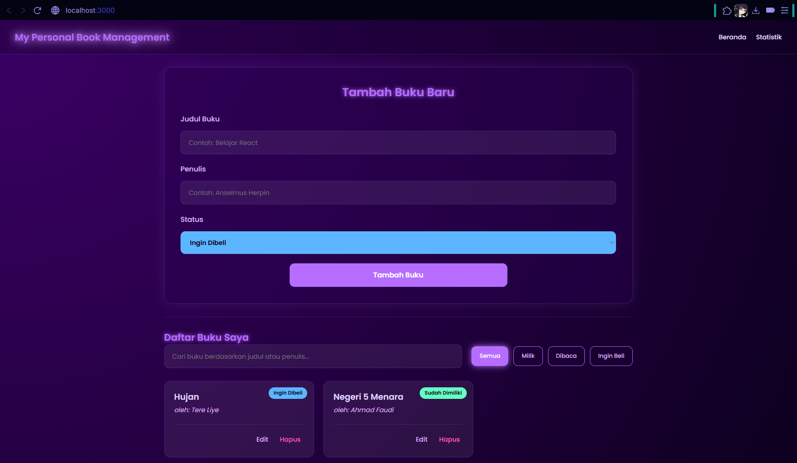
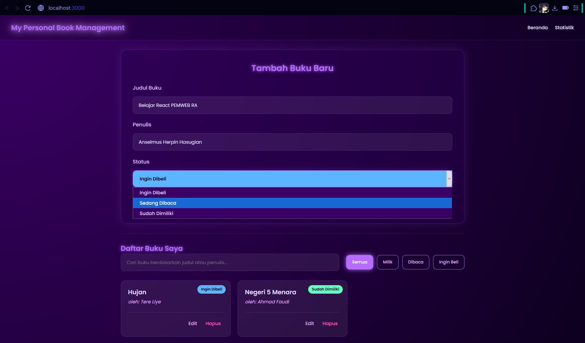
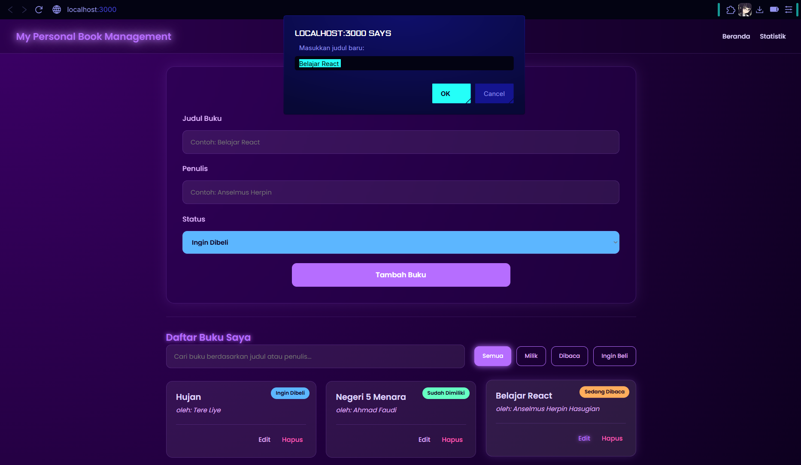
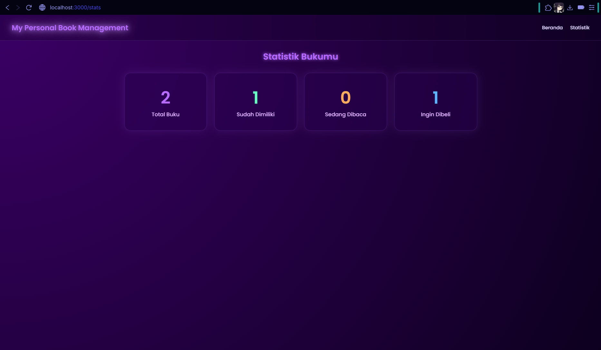
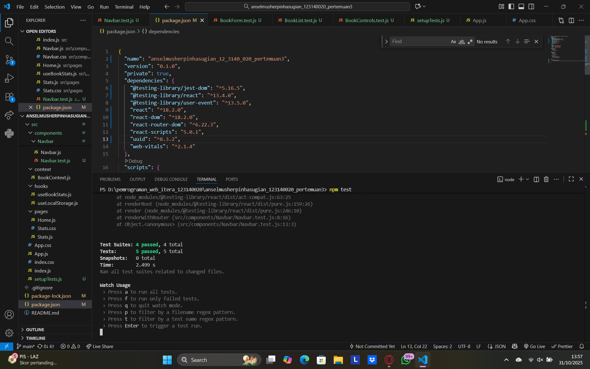

# Tugas Praktikum: Aplikasi Manajemen Buku Pribadi (React)

## Deskripsi Singkat
Aplikasi Manajemen Buku Pribadi ini adalah aplikasi web yang dibangun pakai **React** untuk praktikum Pemrograman Web Pertemuan ke-3. Tujuannya untuk membantu mencatat koleksi buku, buku yang sedang dibaca, atau yang baru ingin dibeli.

Aplikasi ini smenyimpan data di `localStorage` jadi aman walaupun browser ditutup, dan sudah dilengkapi fitur *routing* untuk pindah halaman.

## Run Demo Tugas Praktikum 3 Anselmus Herpin Hasugian (123140020)
link: https://bukusaya.page.gd

## Cara Menjalankan Aplikasi
Aplikasi ini tidak di-deploy, tapi bisa dijalankan dengan mudah secara lokal:

1.  Masuk ke folder praktikum:
    ```bash
    cd anselmusherpinhasugian_123140020_pertemuan3
    ```
2.  Instal *packages* yang dibutuhkan:
    ```bash
    npm install
    ```
3.  Jalankan aplikasi:
    ```bash
    npm start
    ```
4.  Buka `http://localhost:3000` di browser.

## Fitur Utama
* **Tambah Buku:** Bisa menambah buku baru (judul, penulis, dan status).
* **Hapus Buku:** Menghapus buku dari daftar.
* **Simpan Permanen:** Data disimpan di `localStorage` jadi tidak hilang.
* **Pencarian:** Mencari buku di koleksi secara *real-time* berdasarkan judul atau penulis.
* **Filter:** Memfilter buku berdasarkan status (Milik, Dibaca, Ingin Beli).
* **Pindah Halaman:** Navigasi antara Halaman Beranda dan Halaman Statistik.
* **Statistik:** Halaman khusus untuk melihat rekap jumlah buku di koleksi.

## Persyaratan & Fitur React yang Dipakai
Aplikasi ini dibuat untuk memenuhi semua poin di modul praktikum:

* **Arsitektur Komponen:** Memecah UI menjadi komponen-komponen *reusable* (seperti `Navbar`, `BookForm`, `BookItem`, dll).
* **Hooks (State & Lifecycle):**
    * Menggunakan `useState` untuk mengelola *state* di form.
    * Menggunakan `useEffect` di dalam *custom hook* `useLocalStorage`.
* **State Management Global:**
    * Menggunakan **Context API** (`BookContext`) untuk menyimpan semua data buku dan fungsi (tambah, hapus) secara global.
* **Navigasi:**
    * Menggunakan **React Router** untuk membuat aplikasi bisa pindah-pindah halaman (Beranda & Statistik).
* **Custom Hooks:**
    * Berhasil membuat 2 *custom hook*: `useLocalStorage` (untuk simpan data) dan `useBookStats` (untuk hitung statistik).
* **Testing:**
    * Berhasil membuat **5 test unit** menggunakan Jest dan React Testing Library, dan semua tesnya lulus (PASS).
* **Error Handling:**
    * Menerapkan *error handling* sederhana di form tambah buku.

## Screenshot Aplikasi

### Halaman Utama (Tambah & Daftar Buku)


### Fitur CRUD dan LocalHost (Menambah Buku)


### Fitur CRUD dan LocalHost (Mengedit atau Menghapus Buku dari LocalHost)


### Halaman Statistik Buku


### Laporan Hasil Testing (5 Tes Lulus)


---

> Dibuat oleh Anselmus Herpin Hasugian (123140020) — Praktikum Pemrograman Web RA