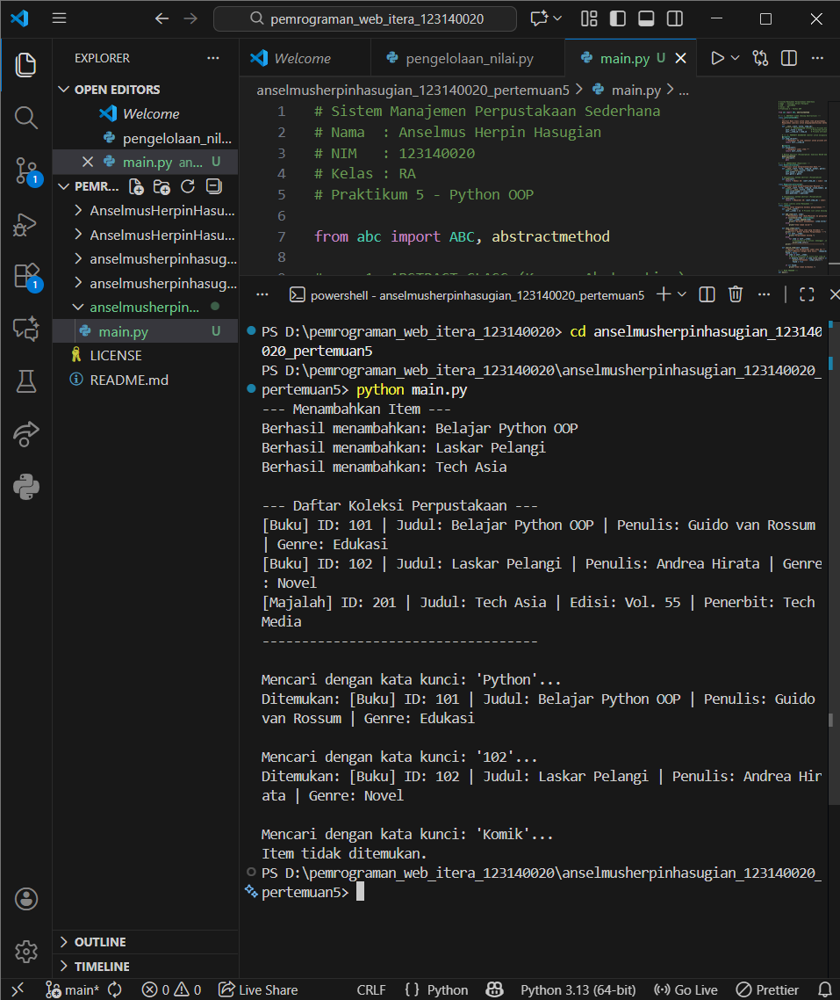

# Sistem Manajemen Perpustakaan Sederhana (Python OOP)

**Nama:** Anselmus Herpin Hasugian  
**NIM:** 123140020  
**Kelas:** RA  
**Mata Kuliah:** Praktikum Pengembangan Web (Pertemuan 5)

## Deskripsi Program
Program ini adalah sistem manajemen perpustakaan sederhana yang menerapkan paradigma **Object-Oriented Programming (OOP)**. Program ini memungkinkan pengguna untuk menambahkan buku dan majalah ke dalam koleksi, menampilkan daftar koleksi, serta mencari item berdasarkan judul atau ID.

## Fitur & Konsep OOP yang Digunakan

1.  **Abstract Class (`LibraryItem`)**: Digunakan sebagai *blueprint* dasar. Class ini tidak bisa diinstansiasi langsung dan memaksa subclassnya untuk memiliki method `info()`.
2.  **Inheritance (Pewarisan)**: Class `Book` dan `Magazine` mewarisi sifat dari `LibraryItem`.
3.  **Encapsulation**:
    * Menggunakan **Private Attribute** (`__item_id`) untuk melindungi ID agar tidak diubah sembarangan dari luar class.
    * Menggunakan **Property Decorator** (`@property`) untuk mengakses data private tersebut secara aman.
4.  **Polymorphism**: Method `info()` memberikan output yang berbeda tergantung apakah objek tersebut adalah Buku atau Majalah, meskipun dipanggil dengan cara yang sama.

## Screenshot Hasil Running

Berikut adalah tampilan output terminal saat program dijalankan:



## Diagram Class (Bonus)

Berikut adalah struktur class diagram dari sistem ini:

```mermaid
classDiagram
    class LibraryItem {
        <<Abstract>>
        #_title : str
        -__item_id : int
        +item_id() int
        +title() str
        +info()* str
    }

    class Book {
        +author : str
        +genre : str
        +info() str
    }

    class Magazine {
        +issue_number : str
        +publisher : str
        +info() str
    }

    class Library {
        -__items : list
        +add_item(item)
        +show_items()
        +search_item(keyword)
    }

    LibraryItem <|-- Book
    LibraryItem <|-- Magazine
    Library o-- LibraryItem : Aggregation